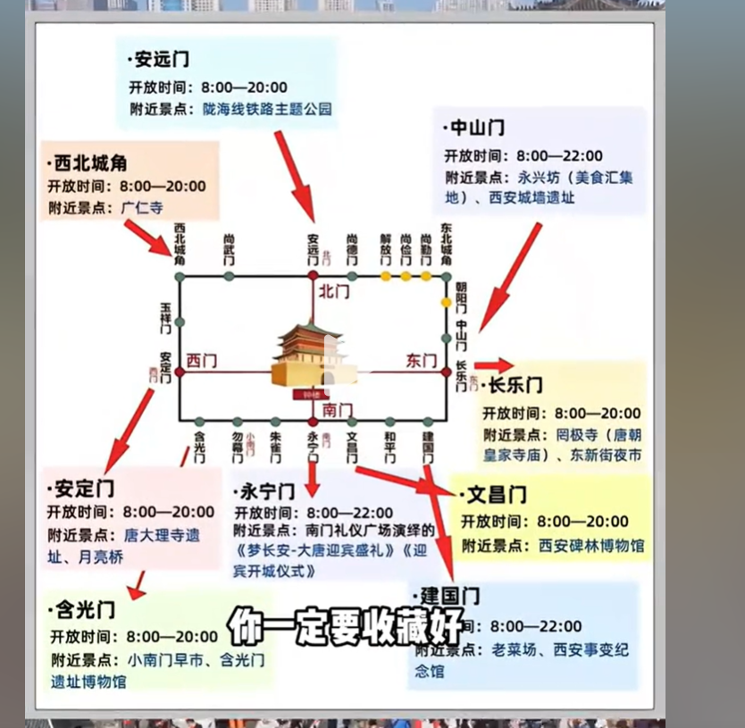
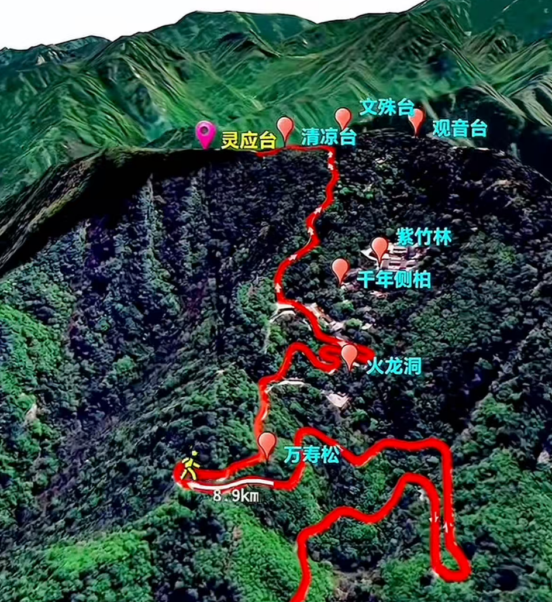
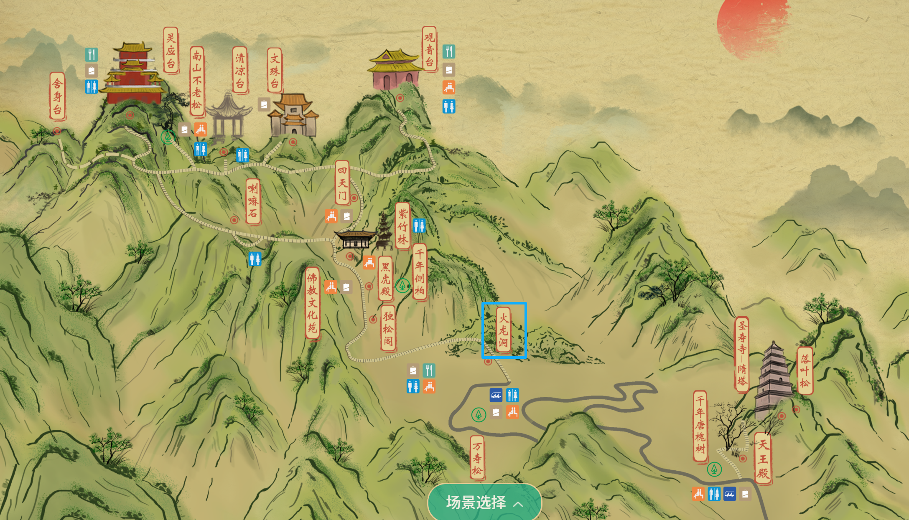

## 攻略

 ### 1.必带物品
```text
        1.证件：身份证；
        2.电器：充电器、充电宝、耳机、相机+电池；
        3.纸巾+湿巾、（可带水，如果附近有可不带）；
        4.防晒伞、防晒衣、防晒霜；
        5.天气热，可以带2到3套衣服；
        6.带洗眼镜的洗涤剂。
        7.国庆游玩，要走很多路，需要有一双比较合脚的鞋：一双好鞋
```
[维也纳国际酒店(长安路店)](https://surl.amap.com/bAvTByVT69x)

### 1.西安鼓楼（国庆人多）
[高德地图位置](https://surl.amap.com/8z2jk41L7bL)
```text
营业时间：周一至周日 08:30-18:00
位置：2号线或6号线  钟楼站(地铁站)
游玩建议：网友建议，晚上6点以后在外面拍照打卡
```

### 2.西安钟楼（国庆人多）
[高德地图位置](https://surl.amap.com/12YDiDdE1Vw)

```text
营业时间：08:30-21:30 （周一至周日 ）
位置：可乘坐2号线或6号线  钟楼站(地铁站)
附近有： 开元商场有观景台
游玩建议：网友建议，晚上6点以后在外面拍照打卡
```

###  3.西安城墙
[高德地图位置](https://surl.amap.com/8BrdyBH1abad)
[城墙入口](https://surl.amap.com/KfVzVbX1e3zq)
```text
营业时间：08:00---22:00
一圈13km,永宁门拍照、游玩都是最好的入口
位置：可乘坐2号线 到  永宁门(地铁站)下
网友建议：晚上去,不会热,夜景还好看些，可租自行车
            黄昏时登城墙最舒服，景色很好
```



### 4.陕西历史博物馆
[高德地图位置](https://surl.amap.com/1t0NeL9Z31E)
```text
营业时间：08:30---19:00
提前预约：提前5天预约，如9月29号可预约10月4号,放票时间17:00
位置：可乘坐2号线;3号线  到  小寨(地铁站)
```

### 5.大雁塔
[高德地图位置](https://surl.amap.com/9vmodYlxeob)
```text
营业时间：08:30---18:00
位置：可乘坐3号线;4号线  到  大雁塔(地铁站)
景点：有音乐喷泉
```

###  6.大唐不夜城
```text
营业时间：全天开放
位置：可乘坐3号线;4号线  到  大雁塔(地铁站)
景点：有古装表演，其他吃喝玩
```

###  7.终南山（西安南边）
[高德地图位置](https://surl.amap.com/u51wRM5FbcH)
```text
海拔： 2604米
位置：西安南边10km 
出行：先做2号地铁到【韦曲南站】B出口730公交，或者 出租车到  山脚下
登山时间：9点-16点     
摆渡车：建议坐摆渡车，30min到登山入口（火龙洞），也是下山第一站
游玩建议：8:00吃早餐，出发
       9:30到达景区、购票、乘景区交通车→
      10:00开始爬山中依次拍照(火龙洞、黑虎殿、佛教文化苑、
                紫竹林、南山不老松)→
      12:00登顶云顶天宫、灵应台，午餐休息→
      13:00文殊台祈福中→
      13:45到达观音台中
      15:00下山返程
```



### 8.其他
[太白山国家森林公园](https://surl.amap.com/tNSB5JtP8iS)
[华山风景名胜区](https://surl.amap.com/1fCJey7Deia)
[长恨歌](https://surl.amap.com/8JmxMfT1l6Vo)
[骊山国家森林公园](https://surl.amap.com/8KDjNPry1Mp)
[秦始皇兵马俑博物馆](https://surl.amap.com/clAjTu1cebd)
 