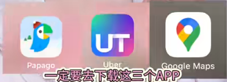
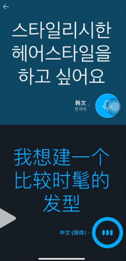
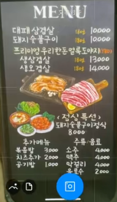
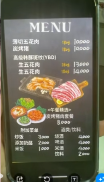
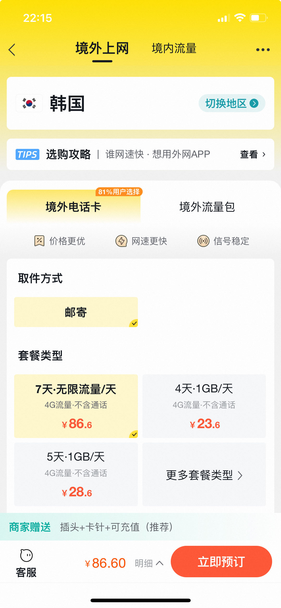

## 攻略

-- -------------------------------------
### 1.必带物品
```text
        现金：
        护照：
        签证：
        充电宝：
        转换插头：
        流量卡：
```


-- -------------------------------------
-- -------------------------------------
### 1.App下载


```text
    Papago:翻译软件,很好用
                    1.可以语音从【中文】翻译成【韩文】
                    2.图片识别为【韩文】
    打车软件1：Uber;
    打车软件2：KaKao T，
                           此软件优点可以用【中国手机号】注册；
                          可以用【现金付款（韩元）】；  
    
    
    地图软件1：GoogleMap;
    地图软件2：NAVER，韩国人自己的地图App
```
> Papago使用效果如图：


 
-- -------------------------------------
-- -------------------------------------
-- -------------------------------------
### 2.【电话卡】
>     1.淘宝上买张韩国电话卡，
>         提前在国内激活
 >     2.提前在中国申请电话卡，然后到韩国办卡
 
-- -------------------------------------
-- -------------------------------------
### 3.【充电转换头】
```text
     在淘宝上买韩国充电器转换头
```
-- -------------------------------------
-- -------------------------------------
### 4.【钱的问题】
```text
 1.支付宝、微信很多地方可以用，但是有些地方是不支持的，
```
```text
2.办Visa银行卡
    去.....可以办
```
```text
3.韩元兑换：
    建议在国内先换好（网友建议）
    韩国很多换钱所只能【现金】换【现金】很麻烦        
    建议在国内换取2000人民币的韩元，
    还是要带些人民币，大不了带回去
    
    线下可以去银行直接换汇【例如工行】
    线上免排队换汇流程【例如工行】
    a.线上换好韩币（在中国工商银行App___换汇模块）
    b.自己打电话电话告知附近支行准备外市
     （小网点可能要打电话，大网点不用打电话，有外币，可以直接去取）
    c.现场直接领取(工行线下网点)
```

### 5.【购物】


```text
 购买大量或刚需产品------->免税店
    1.免税店可线上支付 (微信、支付宝)
    2.免税店店员中文都很好
    
     //https://www.douyin.com/search/%E9%9F%A9%E5%9B%BD%E6%9C%89%E4%B8%87%E8%83%BD%E6%94%BB%E7%95%A5?aid=8fd88134-d855-4ca9-9116-7d2b0c22a83b&modal_id=7293834629616864551&type=general
    国内提前找好韩国免税店返点（可以省下来好多钱的）
    可打折&返点金卡: （这个不懂可以再看下）
        1.不打折商品一九折
        2.打折商品→不能再叠加
```

### 6.【游玩】
```text
        逛街推荐：江南区(清潭洞、新沙洞等)(装修、拍照好看)
                【弘大】如果去喝酒比较推荐
                【明洞】不推荐，类似国内小商品市场
                
```
### 7.【返程】

```text
    提前要三个小时到【仁川机场】
    机场可能要做的事
        1.过安检
        2.退税(28号登机口)
        3.提免税商品(43号登机口)
        4.去返程登机口
    
    仁川机场的登机口，它是需要去坐一班地铁，你才能到的
    下了地铁过后，还要再弯弯绕绕，还要走很多路，
    然后它上面会给你标好
    比如说1-50登机口在这一站，    50-100登机口在这一站 
    一定要看好，如果你下错站了
    你可能会错过这班飞机(这沉重的代价!!!!!!!!)   
```

### 8.【住宿】
```text
    建议江南区：繁华一些，安全舒适干净
```

