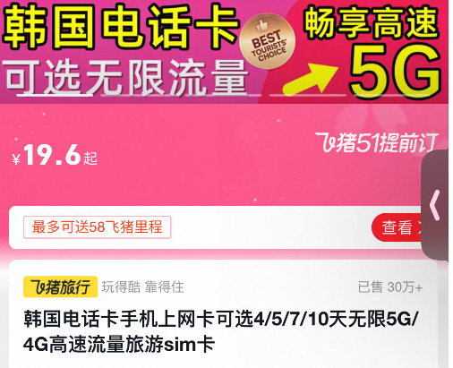
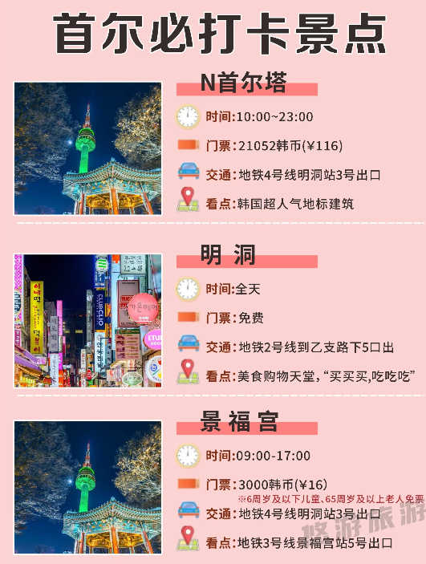
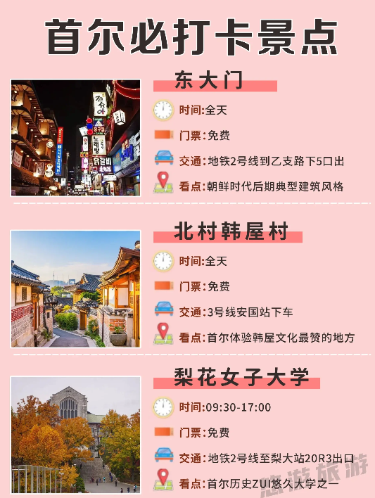

## 攻略

-- -------------------------------------
### 1.必带物品
```text
        现金、 护照、签证、充电宝、 充电器转换插头、 流量卡
        
         韩国很多宾馆酒店不提供一次性用品的
        一次性床上四件套、一次性拖鞋、一次性马桶垫、化妆刷、
        耳塞、雨伞、   便携湿巾、 充电宝、化妆包、湿巾等等
        可以带件外套(晚上温差大)
```

[//]: # (![]&#40;README_IMAGE/010_one_use.png&#41;)
-- -------------------------------------

-- -------------------------------------
### 2.App下载
[//]: # (![]&#40;README_IMAGE/001.jpg&#41;)

```text
    翻译软件1：Papago:翻译软件,很好用
                1.可以语音从【中文】翻译成【韩文】
                2.图片识别为【韩文】
    翻译软件2： 腾讯翻译君
    打车软件1：Uber  用现金或visa卡付款
    打车软件2：KaKao T，
                           此软件优点可以用【中国手机号】注册；
                          可以用【现金付款（韩元）】；  
    地图软件1：GoogleMap;（不太好用）
    地图软件2：NAVER，韩国人自己的地图App
    地图软件3：Baidu地图 （网友建议使用）
    地铁软件1：subway korea，查看韩国地铁地图
    地铁软件2：韩巢韩国地铁，查看韩国地铁地图
    定酒店：agoda
    住宿：airbnb
    mango plate：可实时搜索正在营业的餐厅
    coupang eats支持英文点餐的外卖app
```

[//]: # (> Papago使用效果如图：)

[//]: # (![]&#40;README_IMAGE/002.jpg&#41;)

[//]: # (![]&#40;README_IMAGE/003_1.jpg&#41;)

[//]: # (![]&#40;README_IMAGE/003_2.jpg&#41; )
-- -------------------------------------


-- -------------------------------------
### 3.【电话卡、流量卡】
 > 1.流量卡（淘宝上有）
> 可以给自己的手机号充国际流量
> (不推荐:国外的app可能无法使用)

 

>     2.买张韩国电话卡（淘宝上有）
>         到韩国当地开通，开通第一天没有网络 (网友说的)，
>         要等第二天才有网络的 (网友说的)
>         提前在国内激活？



>     3.到韩国办手机卡，韩国的机场便利店市有电话卡的，
>           可以当场办电话卡（备选方案）


-- -------------------------------------


-- -------------------------------------
### 4.【钱的问题】
```text
 1.支付宝、微信很多地方可以用，但是有些地方是不支持的，
```
```text
2.办Visa银行卡（必须办全币种的信用卡才能刷出来）
    去.....可以办
    如果多人同行，可以使用朋友的visa卡一同使用，
    办visa卡有的有年费
```
```text
3.韩元兑换：
    建议在国内先换好（网友建议）
    韩国很多换钱所只能【现金】换【现金】很麻烦        
    建议在国内换取2000人民币的韩元，
    还是要带些人民币，大不了带回去
    
   【国内】 线下可以去银行直接换汇【例如工行】
```


```text
4.人民币携带
    人民币可以带一些，去韩国后也可以兑换为韩币使用
```

```text
5.可以办张【wowPass卡】，在苹果应用商店下载【wowpass软件】
    买东西，坐公交，坐地铁，人民币兑换韩币，吃饭都能用  （wowPass交通卡部分需要另外充值）
    充值可以在【wowpass软件】查看周边的充卡机器，先办卡，软件绑定卡，然后充值，
    办卡流程可参考下面方式：[或者其他办卡视频都行，网上比较多]        
    https://www.douyin.com/search/wowpass?aid=20f8f196-7611-4135-9cae-fd2040fafd7d&modal_id=7313160982535114003&type=general
    https://www.douyin.com/search/%E9%9F%A9%E5%9B%BD%E6%9C%89%E4%B8%87%E8%83%BD%E6%94%BB%E7%95%A5?aid=8fd88134-d855-4ca9-9116-7d2b0c22a83b&modal_id=7341615573849197862&type=general
    类似软件还有namane等  
```

```text
    6.tmoney卡：公交、地铁、出租车，机场大巴都可以使用
     可以在淘宝买个空卡或者落地韩国时候，机场便利店就有的，然后在便利店充值或地铁站充值即可（不建议一次充太多）
     https://www.douyin.com/search/tmoney%E5%8D%A1?aid=986cfc49-190e-4a24-b87f-ef120d5efcfa&modal_id=7224457400911269178&type=general
     https://www.douyin.com/search/tmoney%E5%8D%A1?aid=986cfc49-190e-4a24-b87f-ef120d5efcfa&modal_id=7353999982866828582&type=general
```
-- -------------------------------------

-- -------------------------------------
### 5.【住宿】
```text
     不清楚住哪里，暂时没查找推荐的住所
```
-- -------------------------------------


-- -------------------------------------
### 6.【购物】


```text
 购买大量或刚需产品------->免税店
    1.免税店可线上支付 (微信、支付宝)
    2.免税店店员中文都很好
    
     //https://www.douyin.com/search/%E9%9F%A9%E5%9B%BD%E6%9C%89%E4%B8%87%E8%83%BD%E6%94%BB%E7%95%A5?aid=8fd88134-d855-4ca9-9116-7d2b0c22a83b&modal_id=7293834629616864551&type=general
    国内提前找好韩国免税店返点（可以省下来好多钱的）
    可打折&返点金卡: （这个不懂可以再看下）
        1.不打折商品一九折
        2.打折商品→不能再叠加
```
-- -------------------------------------


-- -------------------------------------
### 7.【游玩】
```text
      
        逛街推荐：江南区(清潭洞、新沙洞、岬鸥亭、圣水洞、首尔林等)(装修、拍照好看)
        夜市小吃：弘大、明洞、如果去喝酒比较推荐
        N首尔塔(21052韩币(¥116)):《来自星星的你》取景地；拍首尔塔的最佳机位在漫画街
        北村韩屋村：《绅士的品格》取景地
        仁寺洞、清溪川、  东大门、 清潭洞、三清洞路
        青瓦台(预约抽签)
        景福宫(3000韩币(¥16))：《拥抱太阳的月亮》取景地
        弘益大学、 梨花女子大学
        新罗免税店首尔店
        明洞的olive yong可以买韩国本土化妆品
```




-- -------------------------------------


-- -------------------------------------
### 8.【返程】

```text
    提前要三个小时到【仁川机场】
    机场可能要做的事
        1.过安检
        2.退税(28号登机口)
        3.提免税商品(43号登机口)
        4.去返程登机口
    
    仁川机场的登机口，它是需要去坐一班地铁，你才能到的
    下了地铁过后，还要再弯弯绕绕，还要走很多路，
    然后它上面会给你标好
    比如说1-50登机口在这一站，    50-100登机口在这一站 
    一定要看好，如果你下错站了
    你可能会错过这班飞机(注意，注意!!!!!!!!)   
```
-- -------------------------------------

