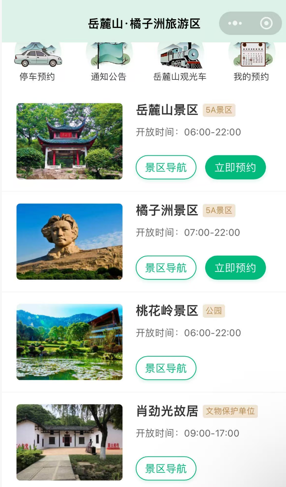

### 1.必带物品
```text
1.证件：身份证；
2.电器：充电器、充电宝、耳机、相机+电池；
3.纸巾+湿巾、（可带水，如果附近有可不带）；
4.防晒伞、防晒衣、防晒霜；
5.天气热，可以带2到3套衣服；
6.带洗眼镜的洗涤剂。
7.国庆游玩，要走很多路，需要有一双比较合脚的鞋：一双好鞋
```


### 2.橘子洲风景名胜区
[橘子洲风景名胜区](https://surl.amap.com/2puPu0qF2iG)<br>
[景区入口](https://surl.amap.com/2oRPT8yeaex)<br>
```text
 营业时间：07:00-22:00 
 位置：可乘坐2号线  橘子洲·青莲(地铁站)  下
  预约：需要提前3天在公众号预约游玩
  景点：毛主席像
```

### 3.岳麓山风景名胜区
[岳麓山风景名胜区](https://surl.amap.com/6PNgniLCfWW)<br>
[景区入口](https://surl.amap.com/2oRPT8yeaex)<br>
```text
 营业时间：06:00-22:00 
 位置：可乘坐2号线;4号线  溁湾镇(地铁站) 下
 游玩： 可乘坐摆渡车和缆车
 预约：需要提前3天在公众号预约游玩，进入景区后可乘坐小火车代步
 景点：爱晚亭、岳麓书院、红楼房、大礼堂、麓山寺、五 轮 塔
```


### 4.湖南省博物院
[湖南省博物院](https://surl.amap.com/idtN8Bz1p3wG)
```text
 营业时间：09:00-17:00  
 位置：可乘坐6号线  湘雅医院(地铁站) 下
 预约：需要提前3天在公众号预约游玩，
```

###  5.古开福寺
[古开福寺](https://surl.amap.com/6cCSEmv1qcyD)
```text
 营业时间：06:30-17:30  
 位置：可乘坐1号线  开福寺(地铁站) 下
 预约：无需预约
```

### 6.五一广场
[五一广场](https://surl.amap.com/6cCSEmv1qcyD)
```text
 营业时间：06:30-17:30  
 位置：可乘坐区1号线;2号线  五一广场(地铁站) 下
 预约：商业街
```

### 7.其他
[IFS国金中心](https://surl.amap.com/193ouTFT3rZ)<br>
[黄兴步行街](https://surl.amap.com/f5expVGw7TU)<br>
[杜甫江阁](https://surl.amap.com/2XaGaATl5rB)<br>
